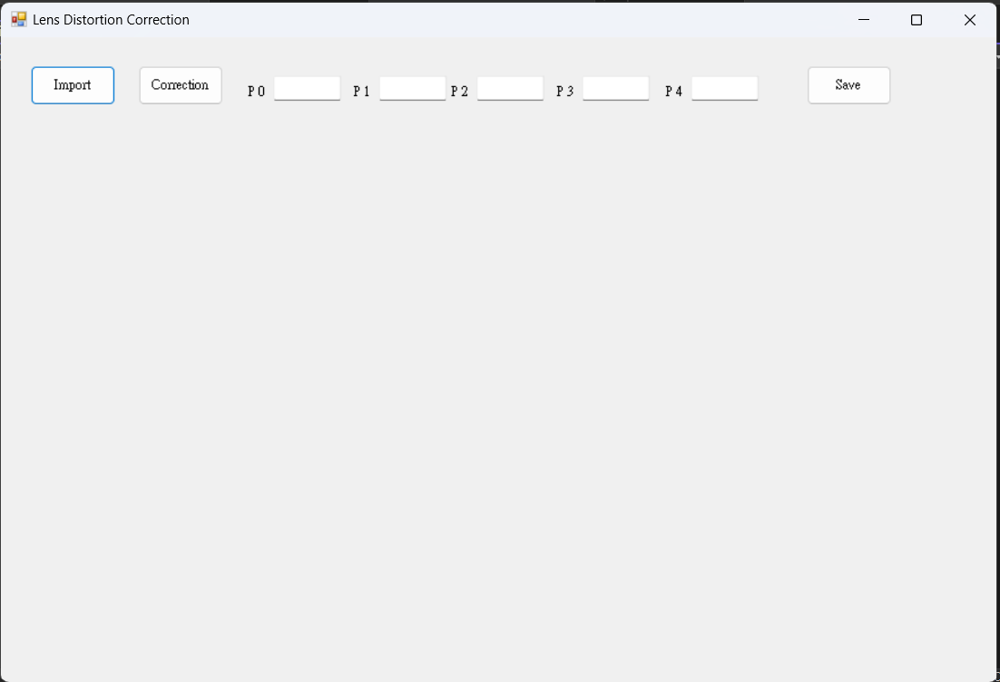
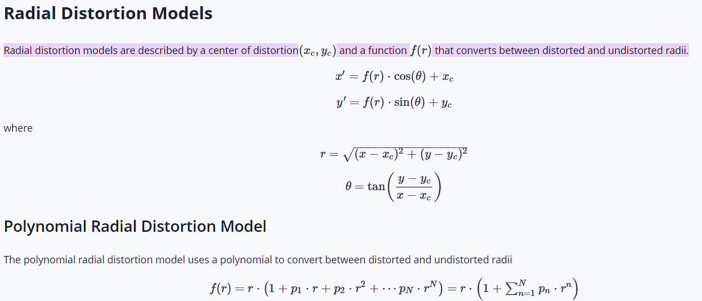
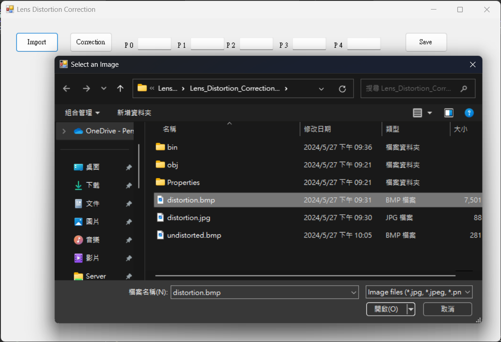
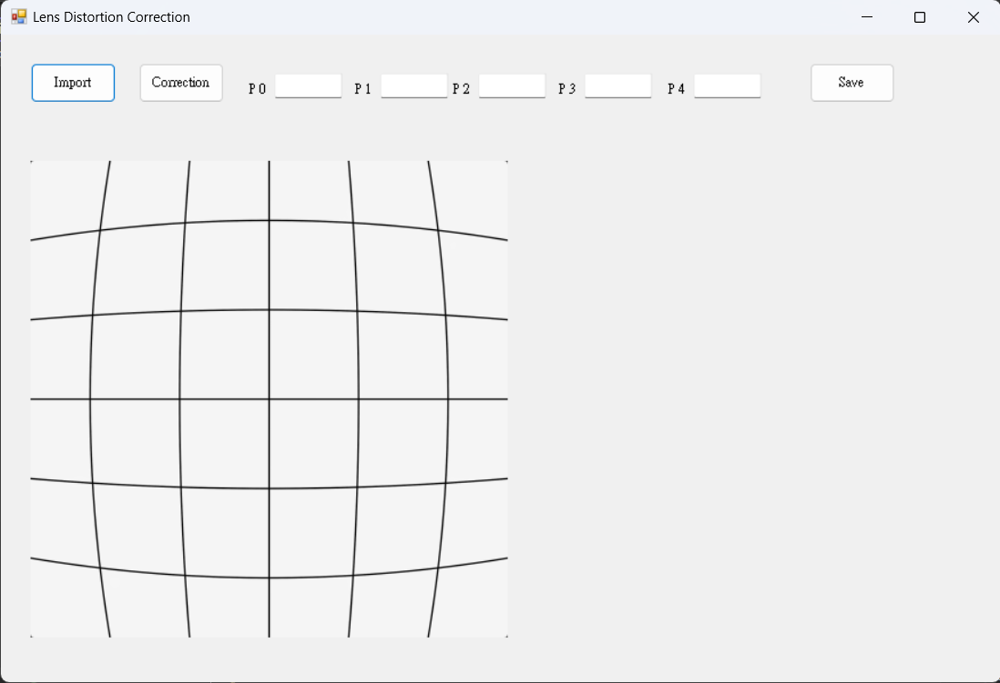
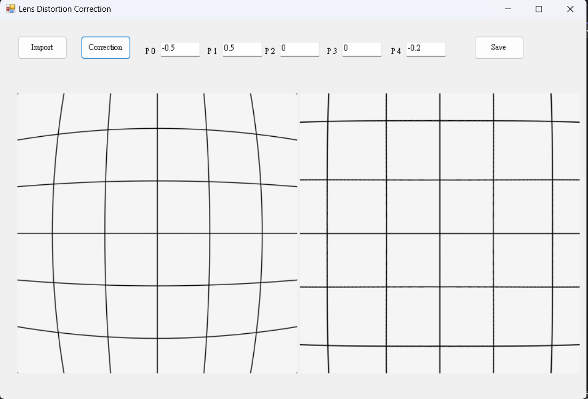
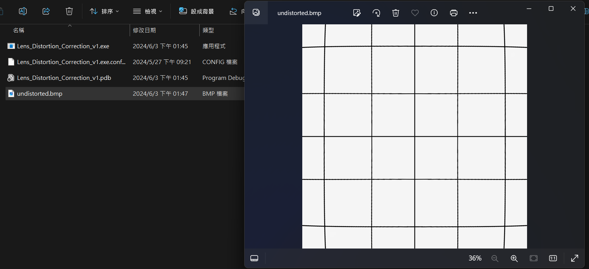

#Lens Distortion Correction
 Figure 1. LDC Main UI 

## Normalisation

## Camera Parameters
fx, fy correspond to the scale of the image. If the image is required to scale larger, the fx should be larger than the width & height of the original image.
cx, cy are the center of the distorted image.

This step aims to scale the position of pixels between -1~1.

## Distortion Parameters
 Figure 2. Radial_Distortion_Model 

The project utilizes the Polynomial Radial Distortion Model, only adopting the even part 

### Radial distortion

- f(r) = 1 + p1 * r2 + p2 + r4 + p3 * r6. 
- r = x2 + y2.

- X(Distored) = X(Undistored) * [1 + p1 * r2 + p2 + r4 + p3 * r6]
- Y(Distored) = Y(Undistored) * [1 + p1 * r2 + p2 + r4 + p3 * r6]

Here, x & y are the positions of pixels in a distorted image.

### Tangential distortion

In addition to radial distortion, the LDC function also takes "Tangential distortion" into consideration. The tangential distortion model adopts the Polynomial Tangential Distortion Model as follows.

- X(Distored) = X(Undistored) + {p1 * [2 * X(Undistored)] + p2 * [r2 + 2 * X(Undistored)2]}
- Y(Distored) = Y(Undistored) + {p1 * [r2 + 2 * Y(Undistored)2] + p2 * [2 * Y(Undistored)]}

### Combination
The combination of the 2 distortion models will be 
- X(Distorted) = X(Undistored) * [1 + p1 * r2 + p2 + r4 + p3 * r6] + {p1 * [2 * X(Undistorted)] + p2 * [r2 + 2 * X(Undistorted)2]}

- Y(Distorted) = Y(Undistored) * [1 + p1 * r2 + p2 + r4 + p3 * r6] + {p1 * [r2 + 2 * Y(Undistorted)2] + p2 * [2 * Y(Undistorted)]}

## Results
Step 1. Import the image from the local path as shown in Figure 3.
 Figure 3. Import image 

Step 2. Input the parameters from the UI as shown in Figure 4; P1 & P2 & P5 mainly correct the radial distortion. P3 & P4 are mainly correct for the tangential distortion.
 Figure 4. Input parameters 

Step 3. Click the correction button to correct the distorted image as shown in Figure 5.
 Figure 5. Generate corrected image 

Step 5. Save the corrected image to the local path as shown in Figure 6.
 Figure 6. Save the corrected image to the local host

# REFERENCE
- Tzeng, A. (2020) '影像畸變 Image Distortion', Allen Tzeng Blog, 15 February. Available at: https://allen108108.github.io/blog/2020/02/15/%E5%BD%B1%E5%83%8F%E7%95%B8%E8%AE%8A%20Image%20Distortion/ (Accessed: 29 May 2024).

- Juyang Weng, Paul Cohen, and Marc Herniou. 1992. Camera Calibration with Distortion Models and Accuracy Evaluation. IEEE Trans. Pattern Anal. Mach. Intell. 14, 10 (October 1992), 965–980.

- Jianhua Wang, Fanhuai Shi, Jing Zhang, and Yuncai Liu. 2008. A new calibration model of camera lens distortion. Pattern Recogn. 41, 2 (February 2008), 607–615.

- 祥 (2015) '[图像]畸变校正详解', CSDN博客, 14 April. Available at: https://blog.csdn.net/humanking7/article/details/45037239 (Accessed: 29 May 2024).

- weixin_41284198 (2018) '内参矩阵', CSDN博客, 29 July. Available at: https://blog.csdn.net/weixin_41284198/article/details/81183804 (Accessed: 29 May 2024).

- wuxianfeng1987 (2021) '内参矩阵、外参矩阵、旋转矩阵、平移矩阵、单应矩阵、本征矩阵、基础矩阵', CSDN博客, 15 September. Available at: https://blog.csdn.net/wuxianfeng1987/article/details/120760551 (Accessed: 29 May 2024).

- Imatest LLC (n.d.) 'Distortion Models', Imatest. Available at: https://www.imatest.com/support/docs/pre-5-2/geometric-calibration-deprecated/distortion-models/#:~:text=Radial%20distortion%20models%20are%20described,between%20distorted%20and%20undistorted%20radii (Accessed: 29 May 2024).

- First Principles of Computer Vision (2021) 'Linear Camera Model | Camera Calibration', YouTube, 12 October. Available at: https://www.youtube.com/watch?v=qByYk6JggQU (Accessed: 29 May 2024).

- Moris (2022) 'Camera Calibration 相機校正', Medium. Available at: https://medium.com/image-processing-and-ml-note/camera-calibration-%E7%9B%B8%E6%A9%9F%E6%A0%A1%E6%AD%A3-2632f302bcbd (Accessed: 29 May 2024).
